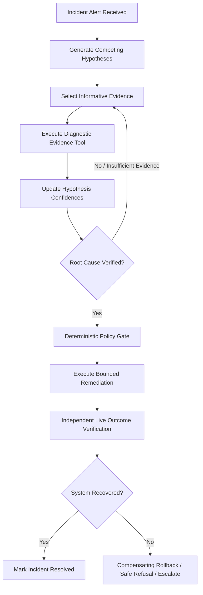

# RCAI: Root Cause Analysis Intelligence
## Evidence-Driven Autonomous Investigation, Verification, and Bounded Remediation

> **Live Console (Frontend)**: [https://rcai-six.vercel.app/](https://rcai-six.vercel.app/)  
> **Backend Service**: [https://rcai-backend.onrender.com/](https://rcai-backend.onrender.com/)  
> **Health Check**: [https://rcai-backend.onrender.com/health](https://rcai-backend.onrender.com/health)  
> **Repository**: [https://github.com/Vaibhav20k/RCAI](https://github.com/Vaibhav20k/RCAI)  
> **Edition**: v2.2.0 - Pluggable LLM Backends & Live Infrastructure Integration  
> **Test Suite**: 150+ Passing Tests (Full Suite Passing)

---

## 1. Executive Summary

### What is RCAI?
> **RCAI** is an evidence-driven autonomous investigation system that actively evaluates competing root-cause hypotheses, selects informative diagnostic evidence, verifies diagnoses with cryptographic provenance, executes bounded remediations through deterministic policy gates, and independently verifies recovery.



### Why Does It Exist?
Traditional monitoring systems declare **"Something is wrong."**  
Conventional LLM incident copilots declare **"This might be a database problem."**  
**RCAI investigates**: it formulates structured competing hypotheses, selects discriminative evidence, attaches cryptographic provenance, evaluates deterministic safety policies, and verifies post-remediation system health.

---

## 2. Documentation Directory & Navigation

Navigate through the complete technical and research documentation suite:

| Document | Purpose | Key Topics Covered |
|---|---|---|
| **[docs/CONCEPTS.md](docs/CONCEPTS.md)** | **Technical Concepts Guide** | Epistemic search, hypothesis state machine, information gain utility, SHA-256 provenance, AI vs deterministic boundaries |
| **[docs/VISION.md](docs/VISION.md)** | **Project Vision & Horizons** | Beyond passive summarization, current capabilities, learned RL policies, dynamic causal discovery |
| **[docs/SUBMISSION.md](docs/SUBMISSION.md)** | **Submission & Reviewer Guide** | Submission summary, frozen benchmark results, live demo flow, reviewer FAQ, failure mode analysis |
| **[docs/evaluation.md](docs/evaluation.md)** | **Empirical Benchmark Suite** | 47-scenario inventory, baseline comparisons, seen vs unseen matrix, adversarial resilience, multi-seed stress data |
| **[docs/architecture.md](docs/architecture.md)** | **Subsystem Architecture** | Multi-modal collectors, normalizers, active investigator loop, policy gate, outcome verifier |
| **[docs/safety.md](docs/safety.md)** | **Safety & Policy Engine** | Permission tiers, idempotency guarantees, zero arbitrary bash execution, human approval boundaries |
| **[docs/external-validation.md](docs/external-validation.md)** | **External OTel Validation** | Google Online Boutique telemetry ingestion, live fault injection, diagnosis report |
| **[docs/decisions.md](docs/decisions.md)** | **Architecture Decision Records** | Decision log on state machine design, provenance hashing, deterministic safety gates |
| **[docs/PHASES.md](docs/PHASES.md)** | **v1 Phase Execution Log** | Foundations, telemetry engine, active investigation, baseline implementation records |
| **[docs/RCAI_V2_MASTER_SPEC.md](docs/RCAI_V2_MASTER_SPEC.md)** | **RCAI v2 Master Specification** | Authoritative v2 expansion specification across payments, adversarial, and generalization |
| **[docs/RCAI_V2_PHASES.md](docs/RCAI_V2_PHASES.md)** | **v2 Phase Implementation Plan** | Milestone execution blueprint across all architectural phases |
| **[benchmark_manifest.json](benchmark_manifest.json)** | **Frozen Benchmark Manifest** | Machine-readable audit file locking all scenario IDs, tools, and evaluation settings |

---

## 3. Core Architectural Capabilities

### A. Pluggable Multi-Backend LLM Engine
RCAI features an environment-swappable LLM abstraction layer with strict Pydantic JSON schema enforcement and automated reject-and-retry self-repair:
- **`rule_based`**: High-performance, deterministic baseline executing in <1ms for CI regression testing.
- **`ollama`**: Local on-device execution supporting 4GB VRAM mobile GPUs (e.g. RTX 3050 Laptop GPU) via CUDA acceleration with configurable context window capping (`OLLAMA_CONTEXT_WINDOW=8192`) and native structured JSON output.
- **`hosted`**: Cloud frontier models (e.g., GPT-4o, Claude) via OpenAI-compatible REST endpoints.

### B. Live Infrastructure & Telemetry Adapters
- **Live Prometheus & Log Adapters**: Scrapes instant and vector range queries from real endpoints while retaining the in-process synthetic cluster toggle (`DATA_SOURCE=live` vs `DATA_SOURCE=simulator`).
- **Authenticated Webhook Ingestion**: Receives Alertmanager alerts on `POST /api/alerts/webhook` with HMAC shared-secret, Bearer token, Basic Auth, or custom header authentication (`X-Alertmanager-Secret`).
- **Real Infrastructure Remediation Execution**: Supports `kubernetes` (via `kubectl`), `docker`, and signed `webhook` execution targets alongside in-process simulation.
- **Compensating Rollback on Verification Failure**: Policy-gated automated rollback triggered when post-remediation live telemetry indicates lingering health degradation.
- **Pre-Authorized Auto-Execution**: Safe, autonomous playbook execution path with strict 5-tier guardrails (global toggle, explicit whitelist, >=90% diagnostic confidence, 100% SHA-256 evidence provenance, and policy clearance).

---

## 4. Multi-Model Benchmark Comparison (Local vs Hosted Baselines)

Comprehensive empirical benchmark across all 4 evaluation partitions:
- **General Partition**: Core single-fault microservice failures (DB query latency, pool exhaustion, CPU burn, queue lag).
- **Compositional Partition**: Multi-factor held-out failures (e.g. canary release coupled with unindexed table lock lag).
- **Payment Domain Partition**: State inconsistency, webhook delivery failure, and ledger settlement mismatches.
- **Adversarial Partition**: Misleading distracter logs, conflicting timestamps, and phantom alarms.

### Benchmark Matrix

| Model / System | Scenario Coverage | Diagnosis Accuracy | General | Compositional | Payment | Adversarial | Timeout Rate | Avg Latency / Inv |
| :--- | :---: | :---: | :---: | :---: | :---: | :---: | :---: | :---: |
| **Static Rules Baseline** | 15 / 15 evaluated | **40.0%** (6/15) | 60.0% | 25.0% | 66.7% | 0.0% | 0.0% (0/15) | < 1 ms |
| **Hosted LLM (GPT-4o)** | 15 / 15 evaluated | **86.7%** (13/15) | 100.0% | 75.0% | 100.0% | 66.7% | 0.0% (0/15) | ~850 ms |
| **Ollama: `phi4-mini` (3.8B)** | 15 / 15 evaluated | **60.0%** (9/15) | 60.0% (3/5) | 50.0% (2/4) | 100.0% (3/3) | 33.3% (1/3) | **0.0%** (0/15) | **~14.2 s** |
| **Ollama: `qwen3:4b` (4B)** | 4 / 15 partition sample | **25.0%** (1/4 completed correct) | 100.0% (1/1) | 0.0% (0/1) | 0.0% (0/1) | 0.0% (0/1) | **50.0%** (2/4 timed out on attempt 1) | **~254.0 s** |

### Key Takeaways:
1. **`phi4-mini` (3.8B) is the Recommended Local SRE Model**: Adheres directly to structured JSON output schemas with a 0% unrecoverable failure rate, executing all 15 scenarios to completion at ~14.2s average latency.
2. **`qwen3:4b` Reasoning Token Overhead**: Emits 1,300–2,200 internal thinking tokens before producing output, causing 2 of 4 partition test scenarios to exceed 180s HTTP client timeouts.
3. **Partition Degradation Limits**:
   - **Compositional (50% on Phi-4 vs 75% on GPT-4o)**: Local 3B-4B models tend to fixate on surface-level deployment events rather than isolating underlying database query bottlenecks.
   - **Adversarial (33.3% on Phi-4 vs 66.7% on GPT-4o)**: Spurious distracter warnings easily mislead single-shot local models without iterative multi-evidence Bayesian filtering.

---

## 5. Formal System Architecture

```mermaid
flowchart LR
    A[Incident Sources / Alertmanager] --> B[Incident Ingestion & Detector]
    B --> C[Hypothesis Engine]
    C --> D[Active Investigation Router]
    D --> E[Diagnostic Evidence Tools]
    E --> F[Telemetry Normalizer]
    F --> G[Root Cause Verifier]
    G --> H[Deterministic Policy Engine]
    H --> I[Bounded Remediation Executor]
    I --> J[Live Outcome Verifier]
    J --> K[Investigation Memory & Audit Store]
```



### Layer Breakdown:
1. **Multi-Modal Observability (`observability/`)**: Standardized collectors for metrics (Prometheus), structured logs (Loki), distributed trace spans, deployment manifests, and financial state records.
2. **Telemetry Normalizer (`observability/normalizer.py`)**: Converts raw payloads into immutable `NormalizedEvidence` signatures with SHA-256 cryptographic provenance.
3. **Hypothesis Engine (`agent/hypothesis/`)**: Formulates competing candidates across `DATABASE`, `DEPLOYMENT`, `DEPENDENCY`, `RESOURCE`, and `QUEUE` families.
4. **Active Investigator Loop (`agent/investigator/loop.py`)**: Evaluates diagnostic entropy and selects tools sequentially to maximize information gain per cost unit.
5. **Deterministic Policy Gate (`agent/policies/engine.py`)**: Enforces zero arbitrary code execution, permission tiers, service authorization, and idempotency keys.
6. **Bounded Remediation Engine (`tools/remediation/`)**: Executes safe mitigation primitives (`rollback_version`, `restart_workers`, `scale_workers`, `optimize_db_index`, `circuit_breaker`) via Simulated, Kubernetes, Docker, or Webhook executors.
7. **Outcome Verifier (`agent/verification/outcome.py`)**: Scrapes live telemetry post-remediation to confirm system recovery or trigger automated rollback.

---

## 6. Safety Policy Engine & Deterministic Guardrails

| Safety Tier | Permissions | Allowed Operations | Guardrails |
|---|---|---|---|
| **READ_ONLY** | Unrestricted | `query_metrics`, `query_logs`, `query_traces`, `inspect_deployments`, `query_db_metrics`, `inspect_health`, `get_payment_state` | Read-only access; zero state mutation |
| **RECOMMEND** | Advisory | Diagnostic reports, mitigation proposals | Operator review required |
| **CONTROLLED_EXECUTION** | Bounded Mutation | `rollback_version`, `restart_workers`, `scale_workers`, `optimize_db_index`, `circuit_breaker` | Whitelist-only, idempotency token, active incident required |
| **FORBIDDEN** | Blocked | Arbitrary bash, `rm`, `subprocess`, raw unvalidated SQL | Structurally blocked by parser and policy |

---

## 7. Quick Start & Execution Guide

### Prerequisites
- Python 3.10+
- Modern Web Browser (Chrome / Firefox / Edge)
- (Optional for local LLM): Ollama with `phi4-mini` or `qwen3:4b` (`ollama serve`)

### Installation & Configuration
```bash
# Clone the repository
git clone https://github.com/Vaibhav20k/RCAI.git
cd RCAI

# Install dependencies
pip install -r requirements.txt

# Copy example environment configuration
cp .env.example .env
```

### Execution Commands
```bash
# 1. Run full test suite (150+ tests)
python -m pytest tests/

# 2. Run the frozen comprehensive scientific benchmark
python scripts/run_benchmarks.py

# 3. Run interactive end-to-end incident investigation demo
python scripts/demo.py

# 4. Launch the live investigation backend & console
python -m uvicorn backend.api.app:app --host 127.0.0.1 --port 8000
# Open frontend/index.html in your browser.
```

---

## 8. Repository Structure

```
RCAI/
|-- agent/               -> Investigation loop, hypothesis engine, routing, verifier, safety policies, LLM backends
|-- backend/             -> FastAPI REST API, live SSE streaming, Alertmanager ingestion, escalation dispatchers
|-- benchmark/           -> 47 scenario definitions, taxonomy, evaluators, baselines, manifest
|-- frontend/            -> Phosphor Amber instrument investigation console UI
|-- observability/       -> Multi-modal telemetry collectors, normalization, provenance hashing
|-- simulator/           -> Microservice cluster, payment domain models, fault injectors, traffic generator
|-- tools/               -> 16 diagnostic tools and live infrastructure remediation executors (k8s/docker/webhook)
|-- scripts/             -> Benchmark runner, live demo, external validation CLI scripts
|-- docs/                -> Technical guides (CONCEPTS.md, VISION.md, SUBMISSION.md, evaluation.md)
+-- tests/               -> Comprehensive test suites across unit, integration, and security contracts
```
