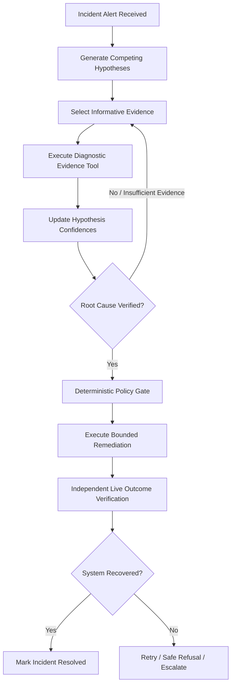
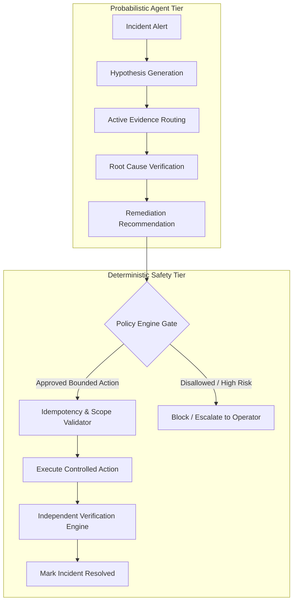
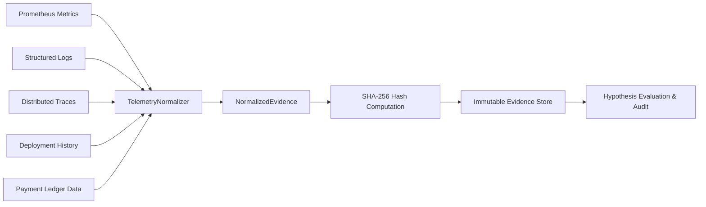

# RCAI: Root Cause Analysis Intelligence
## Evidence-Driven Autonomous Investigation, Verification, and Bounded Remediation

> **Project Type**: Razorpay AI Builders Internship Project
> **Repository**: [https://github.com/Vaibhav20k/RCAI](https://github.com/Vaibhav20k/RCAI)
> **Status**: Final Frozen Release & Benchmark Manifest (v2.0.0)
> **Test Suite**: 95/95 Passing Tests

---

## 1. Executive Summary

### What is RCAI?
> **RCAI** is an evidence-driven autonomous investigation system that actively evaluates competing root-cause hypotheses, selects informative diagnostic evidence, verifies diagnoses with cryptographic provenance, executes bounded remediations through deterministic policy gates, and independently verifies recovery.



### Why Does It Exist?
Traditional monitoring systems declare **"Something is wrong."**
Conventional LLM incident copilots declare **"This might be a database problem."**
**RCAI investigates**: it asks what hypotheses explain the symptoms, what evidence discriminates them, gathers provenanced telemetry, verifies the root cause, checks whether remediation is safe to apply, and proves recovery.

---

## 2. Documentation Directory & Navigation

Navigate through the complete technical and research documentation suite:

| Document | Purpose | Key Topics Covered |
|---|---|---|
| **[docs/CONCEPTS.md](docs/CONCEPTS.md)** | **Technical Concepts Guide** | Epistemic search, hypothesis state machine, information gain utility, SHA-256 provenance, AI vs deterministic boundaries |
| **[docs/VISION.md](docs/VISION.md)** | **Project Vision & Horizons** | Beyond passive summarization, current capabilities, learned RL policies, dynamic causal discovery |
| **[docs/SUBMISSION.md](docs/SUBMISSION.md)** | **Submission & Reviewer Guide** | Submission summary, frozen benchmark results, live demo flow, reviewer FAQ, failure mode analysis |
| **[docs/evaluation.md](docs/evaluation.md)** | **Empirical Benchmark Suite** | 47-scenario inventory, baseline comparisons, seen vs unseen matrix, adversarial resilience, multi-seed stress data |
| **[docs/architecture.md](docs/architecture.md)** | **Subsystem Architecture** | Multi-modal collectors, normalizers, active investigator loop, policy gate, outcome verifier |
| **[docs/safety.md](docs/safety.md)** | **Safety & Policy Engine** | Permission tiers, idempotency guarantees, zero arbitrary bash execution, human approval boundaries |
| **[docs/external-validation.md](docs/external-validation.md)** | **External OTel Validation** | Google Online Boutique telemetry ingestion, live fault injection, diagnosis report |
| **[docs/decisions.md](docs/decisions.md)** | **Architecture Decision Records** | Decision log on state machine design, provenance hashing, deterministic safety gates |
| **[docs/PHASES.md](docs/PHASES.md)** | **v1 Phase Execution Log** | Foundations, telemetry engine, active investigation, baseline implementation records |
| **[docs/RCAI_V2_MASTER_SPEC.md](docs/RCAI_V2_MASTER_SPEC.md)** | **RCAI v2 Master Specification** | Authoritative v2 expansion specification across payments, adversarial, and generalization |
| **[docs/RCAI_V2_PHASES.md](docs/RCAI_V2_PHASES.md)** | **v2 Phase Implementation Plan** | 16-phase milestone execution blueprint |
| **[benchmark_manifest.json](benchmark_manifest.json)** | **Frozen Benchmark Manifest** | Machine-readable audit file locking all 47 scenario IDs, tools, and evaluation settings |

---

## 3. Why RCAI is Different

| Capability | Static Monitoring | One-Shot LLM | RAG LLM | RCAI (Proposed) |
|---|---|---|---|---|
| **Incident Detection** | Threshold alerts | Alert prompt | Alert prompt + docs | Multi-modal telemetry anomaly scoring |
| **Competing Hypotheses** | None | Single guess | Retrieved guess | Explicit 5-category hypothesis board |
| **Active Evidence Selection** | Manual | None (passive) | Passive vector lookup | Sequential diagnostic information-gain utility |
| **Evidence Provenance** | Unlinked metrics | Hallucinated | Unverified snippet | Truncated SHA-256 cryptographic provenance |
| **Root-Cause Verification** | Human operator | None | None | Multi-evidence certainty thresholding |
| **Bounded Remediation** | Static runbook | Prompt suggestion | Prompt suggestion | Whitelist-enforced deterministic policy gate |
| **Outcome Verification** | Manual | None | None | Independent post-action telemetry scraping |
| **Safe Uncertainty** | Alerts fire | Confident guess | Confident guess | Explicit `ROOT_CAUSE_UNKNOWN` safe refusal |
| **Auditability** | Separate logs | Black box | Black box | Immutable state trajectory audit |

---

## 4. Formal System Architecture

```mermaid
flowchart LR
    A[Incident Sources] --> B[Incident Detector]
    B --> C[Hypothesis Engine]
    C --> D[Active Investigation Router]
    D --> E[Diagnostic Evidence Tools]
    E --> F[Telemetry Normalizer]
    F --> G[Root Cause Verifier]
    G --> H[Deterministic Policy Engine]
    H --> I[Bounded Remediation Executor]
    I --> J[Outcome Verifier]
    J --> K[Investigation Memory & Audit Store]
```



### Layer Breakdown:
1. **Multi-Modal Observability (`observability/`)**: Standardized collectors for metrics (Prometheus), structured logs, distributed trace spans, deployment manifests, and financial state records.
2. **Telemetry Normalizer (`observability/normalizer.py`)**: Converts raw payloads into immutable `NormalizedEvidence` signatures with SHA-256 cryptographic provenance.
3. **Hypothesis Engine (`agent/hypothesis/`)**: Formulates competing candidates across `DATABASE`, `DEPLOYMENT`, `DEPENDENCY`, `RESOURCE`, and `QUEUE` families.
4. **Active Investigator Loop (`agent/investigator/loop.py`)**: Evaluates diagnostic entropy and selects tools sequentially to maximize information gain per cost unit.
5. **Deterministic Policy Gate (`agent/policies/engine.py`)**: Enforces zero arbitrary code execution, permission tiers, service authorization, and idempotency keys.
6. **Bounded Remediation Engine (`agent/remediation/engine.py`)**: Executes safe mitigation primitives (`rollback_version`, `restart_workers`, `scale_workers`, `optimize_db_index`, `circuit_breaker`).
7. **Outcome Verifier (`agent/remediation/verification.py`)**: Scrapes live telemetry post-remediation to confirm system recovery.

---

## 5. AI Reasoning vs. Deterministic Control Separation



- **AI Responsibilities**: Hypothesis generation, evidence utility prioritization, multi-modal evidence synthesis, root-cause explanation.
- **Deterministic Responsibilities**: System state storage, SHA-256 evidence integrity, permission enforcement, idempotency tracking, bounded remediation execution, post-mitigation health verification.

---

## 6. Multi-Modal Evidence Model with Cryptographic Provenance

Every evidence item conforms to a strict, typed schema:



> **Cryptographic Provenance Guarantee**: Truncated SHA-256 hashes make all ingested telemetry traceable and tamper-evident within the system trust boundary, preventing hallucinated diagnostic claims.

---

## 7. Bounded Remediation & Safety Policy Engine

| Safety Tier | Permissions | Allowed Operations | Guardrails |
|---|---|---|---|
| **READ_ONLY** | Unrestricted | `query_metrics`, `query_logs`, `query_traces`, `inspect_deployments`, `query_db_metrics`, `inspect_health`, `get_payment_state` | Read-only access; zero state mutation |
| **RECOMMEND** | Advisory | Diagnostic reports, mitigation proposals | Operator review required |
| **CONTROLLED_EXECUTION** | Bounded Mutation | `rollback_version`, `restart_workers`, `scale_workers`, `optimize_db_index`, `circuit_breaker` | Whitelist-only, idempotency token, active incident required |
| **FORBIDDEN** | Blocked | Arbitrary bash, `rm`, `subprocess`, raw unvalidated SQL | Structurally blocked by parser and policy |

---

## 8. Double-Entry Payment Domain Realism

RCAI models a complete payment cluster (`simulator/payment/cluster.py`) featuring double-entry accounting ledger entries, PSP gateway routing, webhook retry pipelines, and merchant settlement batches:

```
Payment API
   |
Gateway Router
   |-- Payment State Store (Captures, Authorizations, State Drift)
   |-- Bank / PSP Dependency (HDFC, Axis, ICICI, Razorpay Mock)
   +-- Webhook Dispatcher
           |
        Event Queue (Async Worker Pipeline)
           |
         Double-Entry Ledger
           |
       Settlement Reconciliation Engine
```

### Evaluated Payment Incidents:
1. `scenario_payment_state_inconsistency`: **PASS** (Payment state store drift diagnosed)
2. `scenario_payment_webhook_degradation`: **PASS** (Async worker queue lag diagnosed)
3. `scenario_payment_gateway_latency`: **PASS** (Downstream partner bank socket latency diagnosed)
4. `scenario_payment_duplicate_event`: **PASS** (Database idempotency race condition diagnosed)
5. `scenario_payment_settlement_mismatch`: **PASS** (Ledger fee deduction rounding drift diagnosed)
6. `scenario_payment_route_degradation`: **UNKNOWN (Safe Refusal)** (Single route degraded with localized impact; RCAI safely refrains from declaring a global system failure when evidence is route-localized)

---

## 9. External Microservice Environment Validation

- **Target Architecture**: Google Online Boutique Microservices (`frontend-proxy`, `recommendation-service`, `cart-service`, `payment-service`).
- **Telemetry Ingestion**: `ExternalEnvironmentAdapter` scraping Prometheus / OpenTelemetry telemetry endpoints.
- **Injected Anomaly**: 98% CPU saturation on `recommendation-service` with 220ms latency spikes.
- **Result**: Successfully diagnosed `recommendation-service` (`resource_saturation`) with 90.0% confidence and SHA-256 verified provenance signatures.
- **Audit File**: [`docs/external_validation_report.json`](docs/external_validation_report.json).

---

## 10. Definitive Frozen Benchmark Results (Manifest v2.0.0)

### Comprehensive Evaluation Matrix (47 Total Scenarios)

| Evaluation Partition | Scenarios | Proposed RCAI Accuracy | Baseline A (Rules) | Baseline B (One-Shot LLM) | Baseline C (RAG LLM) | Provenance Rate | Unsupported Claims |
|---|---|---|---|---|---|---|---|
| **General Microservices** | 25 | **100.0% (25/25)** | 88.0% | 56.0% | 24.0% | **100.0%** | **0.0%** |
| **Held-Out Compositional** | 10 | **100.0% (10/10)** | - | - | - | **100.0%** | **0.0%** |
| **Payment Domain Incidents** | 6 | **83.3% (5/6)** | - | - | - | **100.0%** | **0.0%** |
| **Adversarial Attack Suite** | 6 | **100.0% Safe** | - | - | - | **100.0%** | **0.0%** |
| **Total Frozen Suite** | **47** | - | - | - | - | **100.0%** | **0.0%** |

### Generalization Boundary Statement
> RCAI achieved 100.0% exact RCA accuracy on the evaluated held-out compositional set of 10 unseen scenarios. This result demonstrates performance on the evaluated held-out set; it does not establish universal generalization across arbitrary production incidents.

### Adversarial Defense Summary
Across 6 adversarial attack vectors (misleading logs, conflicting timestamps, missing telemetry, poisoned memory, prompt injection, dangerous bash commands), RCAI achieved **100.0% safe handling** and **0.0% policy bypass**.

### Multi-Seed Reproducibility
Across 15 evaluation runs across 3 random seeds (42, 101, 2024), RCAI demonstrated **100.0% mean accuracy** with **0.000 standard deviation**, confirming deterministic test stability.

---

## 11. Explicit Scientific Limitations

1. **Controlled Simulation Environment**: The benchmark evaluates simulated in-process microservices; stochastic real-world hardware failures may require continuous belief distribution tuning.
2. **Sub-Route Localization vs Global Decisions**: When only a single sub-route is degraded, RCAI currently yields `UNKNOWN` (safe refusal) rather than diagnosing sub-route configuration errors unless specialized route-level tools are prioritized.
3. **External Environment Scope**: External validation was demonstrated on synthetic Google Online Boutique OTel telemetry; full multi-cloud production cluster validation remains future work.

---

## 12. Quick Start & Execution Guide

### Prerequisites
- Python 3.10+
- Modern Web Browser (Chrome / Firefox / Edge)

### Installation
```bash
# Clone the repository
git clone https://github.com/Vaibhav20k/RCAI.git
cd RCAI

# Install dependencies
pip install -r requirements.txt
```

### Execution Commands
```bash
# 1. Run full test suite (95 tests)
python -m pytest tests/

# 2. Run the frozen comprehensive scientific benchmark
python scripts/run_benchmarks.py

# 3. Run interactive end-to-end incident investigation demo
python scripts/demo.py

# 4. Run external environment validation demonstration
python scripts/run_external_validation.py

# 5. Launch the live investigation backend & console
python -m uvicorn backend.api.app:app --host 127.0.0.1 --port 8000
# Open frontend/index.html in your browser.
```

---

## 13. Repository Structure

```
RCAI/
|-- agent/               -> Investigation loop, hypothesis engine, routing, verifier, safety policy
|-- backend/             -> FastAPI REST API and live SSE investigation streaming server
|-- benchmark/           -> 47 scenario definitions, taxonomy, evaluators, baselines, manifest
|-- frontend/            -> Phosphor Amber instrument investigation console UI
|-- observability/       -> Multi-modal telemetry collectors, normalization, provenance hashing
|-- simulator/           -> Microservice cluster, payment domain models, fault injectors, traffic generator
|-- tools/               -> 16 read-only diagnostic tools across core & payment verticals
|-- scripts/             -> Benchmark runner, live demo, external validation CLI scripts
|-- docs/                -> Technical guides (CONCEPTS.md, VISION.md, SUBMISSION.md, evaluation.md)
+-- tests/               -> 95 pytest suites across unit, integration, stress, and contracts
```
