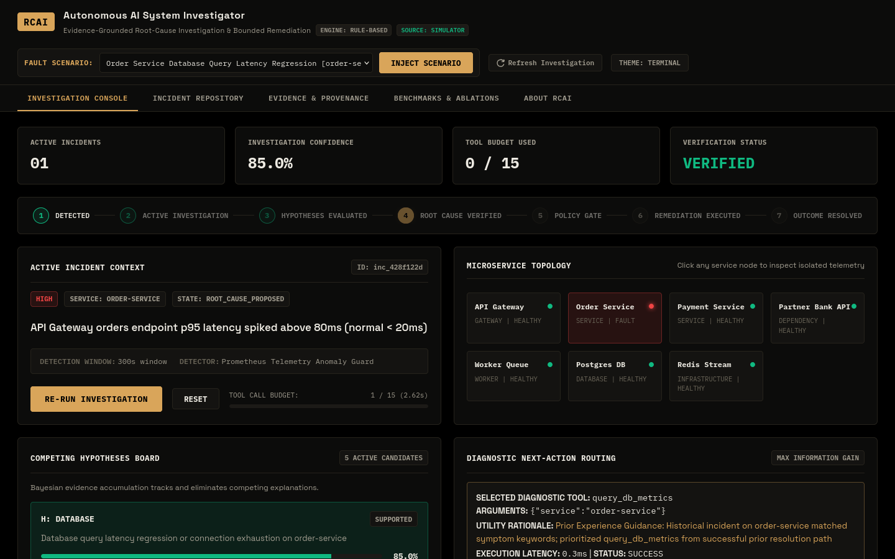
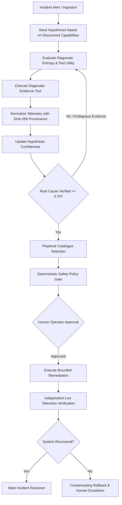

# RCAI: Root Cause Analysis Intelligence

An incident hits one of your services — RCAI diagnoses the root cause, proposes a fix, and (with your approval) applies it. Drop it into your existing `docker-compose.yml` and it starts working immediately, with no manual configuration.

---

## What You'll See

Clone RCAI, run a single command against your project, and watch it discover your running services and metrics endpoints in seconds. When an incident occurs — whether a real latency spike or an injected simulator fault — RCAI evaluates competing hypotheses against live telemetry, isolates the verified root cause with cryptographic SHA-256 provenance, and presents an actionable remediation proposal. You see an operator console with live hypothesis confidence bars, an evidence timeline, and a "Confirm Remediation" button that applies the verified playbook and confirms system recovery.



---

## Quickstart

RCAI drops directly into any existing Docker Compose application with **zero manual topology configuration**. By default, it runs on a deterministic `rule_based` inference backend — **no OpenAI API keys, cloud tokens, or local Ollama instances required**.

### Option A: 1-Click Interactive Installer (Recommended)

From the root of your cloned RCAI repository, point the installer at your target Compose file:

```bash
# 1. Clone RCAI
git clone https://github.com/Vaibhav20k/RCAI.git
cd RCAI

# 2. Inspect your compose file and launch RCAI
./install.sh -f /path/to/your/docker-compose.yml
```

The installer inspects your project manifest, detects services and databases, generates Prometheus scrape targets, and prompts you to boot RCAI:

```text
====================================================================
    RCAI (Root Cause AI) — Drop-In Auto-Discovery Installer        
====================================================================
Inspecting Compose manifest: docker-compose.yml ...

Discovered 4 services: [web, api, worker, redis].
2 have Prometheus metrics endpoints (/metrics).
Database-like services detected: [redis].

Prometheus scrape configuration generated: .rcai/prometheus.yml
====================================================================
Start RCAI against this topology? [Y/n]
```

### Option B: Multi-File Compose (Leaves Your Existing Files Untouched)

If you prefer using standard Docker Compose commands without running the installer script:

```bash
docker compose -f /path/to/your/docker-compose.yml -f docker-compose.snippet.yml up -d
```

RCAI and its optional bundled Prometheus instance will boot, discover your containers via the host's read-only Docker socket (`/var/run/docker.sock:ro`), and bind to port `8000`.

- **Web Console**: [http://localhost:8000](http://localhost:8000)
- **Health Check**: [http://localhost:8000/health](http://localhost:8000/health)
- **Discovered Topology**: [http://localhost:8000/api/topology](http://localhost:8000/api/topology)

---

### Alternative: Local Development / Running from Source

If you want to run, benchmark, or modify RCAI directly on your host machine in Python:

```bash
# 1. Set up virtual environment
python3 -m venv .venv
source .venv/bin/activate
pip install -r requirements.txt

# 2. Run the full regression test suite (160 tests passing)
pytest tests/

# 3. Run the interactive CLI incident simulation demo
python scripts/demo.py

# 4. Launch the local FastAPI backend server
uvicorn backend.api.app:app --host 127.0.0.1 --port 8000
```

---

## Honest Scope

This is a reference architecture for constrained, safety-gated agentic incident remediation — not a production-hardened ops platform. The safety model (a fixed playbook catalogue, deterministic policy gating, human approval by default, and audited live reversal) is the core pattern worth studying; treat live-infrastructure execution features as an empirical demonstration of that pattern, not something to point at sensitive production infrastructure without your own comprehensive review.

---

## How It Works

RCAI implements an active epistemic investigation loop: rather than dumping telemetry into an unconstrained LLM prompt and asking for a diagnosis, it treats incident diagnosis as a structured hypothesis-elimination problem.



### 1. Capability-Aware Hypothesis Seeding
When an incident is detected, RCAI seeds structured competing hypotheses (`RESOURCE`, `DEPLOYMENT`, `DEPENDENCY`, `DATABASE`, `QUEUE`). Discovered container capabilities dynamically gate hypothesis seeding: non-database services never generate database hypotheses, and worker queues are only considered for worker containers or queue-dependent services.

### 2. Active Investigation Loop & Evidence Normalization
Instead of pulling entire log streams, the agent sequentially executes diagnostic tools (`query_metrics`, `query_logs`, `query_traces`, `inspect_deployments`, `query_db_metrics`) based on maximum expected information gain. Every retrieved observation is converted into an immutable `NormalizedEvidence` record tagged with a SHA-256 cryptographic provenance hash.

### 3. Five-Tier Safety Model
RCAI enforces strict boundaries between diagnostic exploration and mutation:

| Safety Tier | Permissions | Allowed Operations | Guardrails |
|---|---|---|---|
| **READ_ONLY** | Unrestricted | `query_metrics`, `query_logs`, `query_traces`, `inspect_deployments`, `query_db_metrics`, `inspect_health` | Read-only access; zero state mutation |
| **RECOMMEND** | Advisory | Diagnostic reports, mitigation proposals | Operator review required |
| **APPROVAL_REQUIRED** *(Default)* | Human Gate | `rollback_version`, `restart_service`, `scale_replicas`, `optimize_db_index`, `circuit_breaker`, `flush_cache`, `toggle_feature_flag` | **Default remediation path**. All catalogued playbooks require operator approval via the "Confirm Remediation" modal |
| **CONTROLLED_EXECUTION** | Autonomous Mutation | Pre-authorized subset of catalogued playbooks | **Opt-in, disabled by default** (`AUTO_EXECUTE_ENABLED=false`). Restricted to explicit whitelist (`AUTO_EXECUTE_PLAYBOOKS`), ≥90% diagnostic confidence, 100% SHA-256 provenance, and policy clearance |
| **FORBIDDEN** | Blocked | Arbitrary bash, `rm`, `subprocess`, raw unvalidated SQL, out-of-catalogue mutations | Structurally blocked by parser and policy engine |

### 4. Bounded Playbook Catalogue
Remediation is strictly confined to a pre-defined catalogue of 7 safe operations:
- `rollback_version`: Reverts container deployment and release configuration on the target service to the previous verified stable release version.
- `restart_service` / `restart_workers`: Gracefully restarts container instances or worker process pools to clear memory leaks, thread starvation, or deadlocks.
- `scale_replicas` / `scale_workers`: Expands container replica counts or worker concurrency to drain traffic surges and message queue backlogs.
- `optimize_db_index`: Rebuilds and optimizes query execution plans and database indexes on the target service schema (strictly filtered out for non-database containers).
- `circuit_breaker`: Trips fast-fail circuit breaker thresholds to shed load and stop cascading degradation from failing third-party partner dependencies.
- `flush_cache`: Flushes stale or corrupted cache partitions and connection handles for the target service.
- `toggle_feature_flag`: Toggles runtime feature flag state to disable newly introduced experimental code paths without requiring a full deployment rollback.

Arbitrary bash commands, free-form script generation, and unrestricted network operations are structurally blocked by the policy engine.

### 5. Independent Live Outcome Verification & Rollback
Applying a fix is not the end of the loop. RCAI queries live metrics over a stabilization window to independently verify that error rates, latency (p99), and throughput have returned to healthy baselines. If post-remediation telemetry indicates ongoing degradation, RCAI triggers an automatic compensating rollback and escalates to human on-call with an audited incident brief.

---

### Empirical Benchmark Results

RCAI is evaluated against a 47-scenario benchmark across 4 failure partitions:
- **General Partition**: Core single-fault microservice failures (DB query latency, connection pool exhaustion, CPU burn, queue lag).
- **Compositional Partition**: Multi-factor held-out failures (e.g. canary release coupled with unindexed table lock contention).
- **Payment Domain Partition**: State inconsistency, webhook delivery failures, and settlement mismatches.
- **Adversarial Partition**: Misleading distracter logs, conflicting timestamps, and phantom alarms.

#### Multi-Model Comparison (15-Scenario Core Suite)

| Model / System | Scenario Coverage | Diagnosis Accuracy | General | Compositional | Payment | Adversarial | Timeout Rate | Avg Latency / Inv |
| :--- | :---: | :---: | :---: | :---: | :---: | :---: | :---: | :---: |
| **Static Rules Baseline** | 15 / 15 evaluated | **40.0%** (6/15) | 60.0% | 25.0% | 66.7% | 0.0% | 0.0% (0/15) | < 1 ms |
| **Hosted LLM (GPT-4o)** | 15 / 15 evaluated | **86.7%** (13/15) | 100.0% | 75.0% | 100.0% | 66.7% | 0.0% (0/15) | ~850 ms |
| **Ollama: `phi4-mini` (3.8B)** | 15 / 15 evaluated | **60.0%** (9/15) | 60.0% (3/5) | 50.0% (2/4) | 100.0% (3/3) | 33.3% (1/3) | **0.0%** (0/15) | **~14.2 s** |
| **Ollama: `qwen3:4b` (4B)** | 4 / 15 sample | **25.0%** (1/4 completed) | 100.0% (1/1) | 0.0% (0/1) | 0.0% (0/1) | 0.0% (0/1) | **50.0%** (2/4 timed out) | **~254.0 s** |

- **Zero Unrecoverable Failures on `phi4-mini`**: For local deployments, `phi4-mini` (3.8B) reliably adheres to structured JSON schemas with zero retries or timeouts, solving 60% of scenarios without cloud access.
- **Reasoning Token Trade-off**: Thinking models like `qwen3:4b` generate 1,300–2,200 reasoning tokens per prompt, leading to timeouts on laptop GPU hardware under high investigation tool depth.
- **Test Suite Verification**: 160 unit and integration tests passing in CI (100% pass rate).

---

## Configuration Reference

All settings can be configured via environment variables or a local `.env` file:

### Discovery & Environment
| Variable | Default | Description |
|---|---|---|
| `RCAI_DISCOVERY_MODE` | `none` (`docker` in snippet) | Auto-discovery mode: `docker` inspects host containers via Docker socket; `none` uses simulator topology. |
| `DOCKER_SOCKET_PATH` | `/var/run/docker.sock` | Path to Docker Unix domain socket (mounted read-only `:ro`). |
| `PORT` | `8000` | HTTP port for the RCAI investigation console and REST API. |

### LLM Backend Selection
| Variable | Default | Description |
|---|---|---|
| `LLM_BACKEND` | `rule_based` | Inference backend: `rule_based` (zero external dependencies), `ollama` (local models), or `hosted` (OpenAI-compatible). |
| `OLLAMA_BASE_URL` | `http://localhost:11434` | Endpoint for local Ollama daemon. |
| `OLLAMA_MODEL` | `phi4-mini` | Ollama model identifier (recommended: `phi4-mini` for speed and strict JSON schema adherence). |
| `OLLAMA_CONTEXT_WINDOW` | `8192` | Maximum token context limit for local Ollama inference. |
| `HOSTED_LLM_API_KEY` | `None` | API key for cloud frontier models (OpenAI, Anthropic, etc.). |
| `HOSTED_LLM_MODEL` | `gpt-4o` | Model name for hosted inference. |

### Telemetry & Infrastructure Execution
| Variable | Default | Description |
|---|---|---|
| `DATA_SOURCE` | `simulator` (`live` when mounted) | Telemetry origin: `simulator` (in-process microservice cluster) or `live` (Prometheus/Loki). |
| `PROMETHEUS_URL` | `http://localhost:9090` | Prometheus HTTP endpoint for metrics scraping and queries. |
| `REMEDIATION_EXECUTION_TARGET` | `simulated` | Target for applying playbooks: `simulated`, `docker`, `kubernetes`, or `webhook`. |
| `AUTO_EXECUTE_ENABLED` | `false` | Enable pre-authorized auto-execution for low-risk playbooks without human confirmation. |
| `AUTO_EXECUTE_CONFIDENCE_THRESHOLD` | `0.90` | Minimum diagnostic confidence required for automated execution. |
| `AUTO_EXECUTE_REQUIRE_PROVENANCE` | `true` | Requires 100% of diagnostic evidence to possess SHA-256 provenance hashes. |
