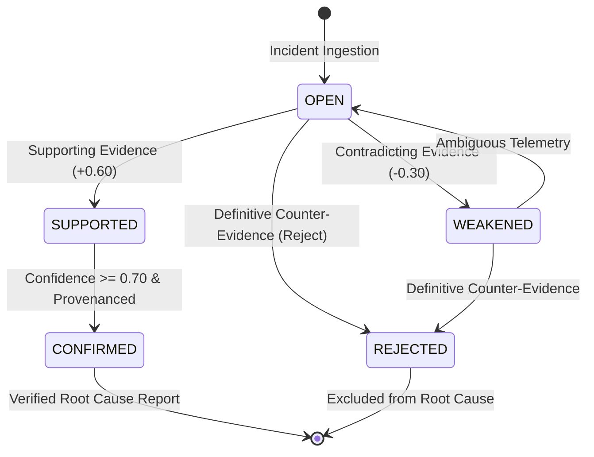
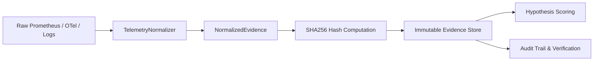
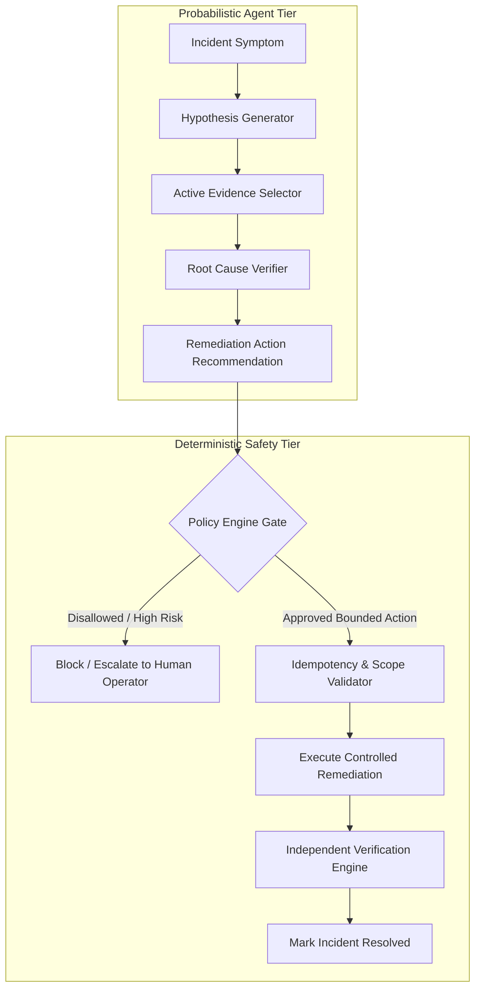

# RCAI Technical Concepts Guide
## Core Theoretical and Engineering Foundations of Evidence-Driven Root Cause Analysis

This document provides a formal conceptual reference for the Autonomous AI System Investigator (RCAI). It explains the fundamental design patterns, decision theoretic models, and safety boundaries implemented in the system.

---

## 1. Autonomous Investigation vs. Incident Summarization

### What It Is
Autonomous investigation is a sequential decision-making process wherein an intelligent agent evaluates competing explanations for a system failure by actively gathering discriminating evidence, updating its beliefs, and verifying outcomes.

### Why It Exists
Traditional Large Language Model (LLM) incident assistants operate in a **passive, one-shot summarization mode**: given an alert text or log snippet, they predict a plausible root cause without confirming whether the system state supports it. This leads to hallucinated causal links and premature closure.

### How RCAI Implements It
RCAI treats root-cause analysis as an active epistemic search. The `ActiveInvestigator` loop (`agent/investigator/loop.py`) operates in discrete turns:
1. Generate competing hypotheses representing distinct failure modes across microservice dependencies.
2. Select the diagnostic tool with maximum expected information gain.
3. Collect normalized evidence with cryptographic provenance.
4. Update hypothesis confidence scores via evidence-grounded Bayesian-style updates.
5. Terminate only when confidence crosses certainty thresholds or the investigation budget is exhausted.

---

## 2. Hypothesis Management & Lifecycle

### What It Is
A formal state machine tracking candidate failure explanations from initialization to confirmation or rejection.

### Hypothesis States
- **OPEN**: Active candidate under evaluation (default initial confidence: 0.15 - 0.25).
- **SUPPORTED**: Confidence boosted by supporting evidence signatures (> 0.60).
- **WEAKENED**: Confidence reduced by contradictory telemetry.
- **REJECTED**: Ruled out by definitive health checks or contradictory metrics.
- **CONFIRMED**: Designated as the primary root cause exceeding certainty thresholds (confidence >= 0.70).

---

## 3. Active Evidence Selection & Diagnostic Utility

### What It Is
An information-theoretic heuristic for choosing the next diagnostic observation to execute.

### The Decision Metric
$$	ext{Investigation Utility} =
rac{	ext{Expected Information Gain}}{	ext{Tool Execution Cost}}$$

Where:
- **Expected Information Gain**: Quantified by hypothesis uncertainty (proximity of active candidate confidence to 0.50, representing maximum diagnostic entropy).
- **Tool Execution Cost**: Monetary and computational cost estimate associated with tool execution.

### Prevention of Brute Force
In complex distributed topologies, querying all telemetry endpoints simultaneously saturates logging clusters and exhausts rate limits. Sequential selection prioritizes the single most discriminating tool call (e.g. `query_db_metrics` vs `inspect_deployment_history`).

---

## 4. Cryptographic Evidence Provenance

### What It Is
Every evidence record collected by RCAI is normalized into a `NormalizedEvidence` object containing:
- `evidence_id`: Globally unique identifier (`ev_<uuid>`).
- `source`: Telemetry modality (`METRICS`, `LOGS`, `TRACES`, `DEPLOYMENTS`, `DATABASE`).
- `collector`: Subsystem responsible for data extraction.
- `timestamp`: ISO-8601 observation timestamp.
- `query`: Exact diagnostic query string and parameters.
- `reliability`: Sensor reliability coefficient (0.0 to 1.0).
- `provenance.hash_signature`: Truncated SHA-256 hash computed over payload attributes.

> **Important Conceptual Note**: Cryptographic provenance does not prove that an underlying external physical sensor is infallible; rather, it guarantees that once telemetry is ingested across the trust boundary, the record is immutable, traceable, and tamper-evident.

---

## 5. AI Reasoning vs. Deterministic Control Separation

RCAI enforces a strict boundary between non-deterministic probabilistic reasoning and deterministic execution gates:

### Deterministic Invariants:
1. **Zero Arbitrary Code Execution**: No `subprocess.Popen`, arbitrary SQL, or raw bash execution is permitted.
2. **Strict Action Whitelist**: Only predefined bounded remediation primitives (`rollback_version`, `restart_workers`, `scale_workers`, `optimize_db_index`, `circuit_breaker`) are executable.
3. **Idempotency Enforcement**: Duplicate remediation tokens prevent repeated actions during execution flapping.
4. **Independent Verification**: A separate verification pass queries live health stats post-remediation to prove recovery.

---

## 6. Safe Refusal (`ROOT_CAUSE_UNKNOWN`)

### What It Is
The capability of an autonomous system to explicitly output `ROOT_CAUSE_UNKNOWN` or `INSUFFICIENT_EVIDENCE` when available telemetry does not meet strict certainty thresholds (e.g. confidence < 0.65 or supporting evidence unverified).

### Why It Matters
In enterprise environments, an agent that confidently guesses an incorrect root cause initiates incorrect and potentially destructive remediation. Safe refusal allows the system to escalate to human operators while preserving an auditable trail of investigated hypotheses.

---

## 7. Scientific Evaluation & Baseline Framing

RCAI is evaluated against three standard industry baselines:
- **Baseline A (Static Rules)**: Deterministic heuristic regex matching on symptom strings.
- **Baseline B (One-Shot LLM)**: Direct prompt completion predicting root cause without tool execution.
- **Baseline C (RAG LLM)**: Retrieval-augmented generation querying historical incident runbooks.
- **Proposed Active RCAI**: Full autonomous investigation loop with active tool calls and evidence provenance.

### Core Metrics:
- **Exact RCA Accuracy**: Correct service and failure category identification.
- **False Diagnosis Rate**: Incorrect root-cause misattributions.
- **Evidence Provenance Rate**: Fraction of diagnostic claims backed by cryptographic hashes.
- **Unsupported Claim Rate**: Claims asserting a root cause without supporting evidence in the store.
