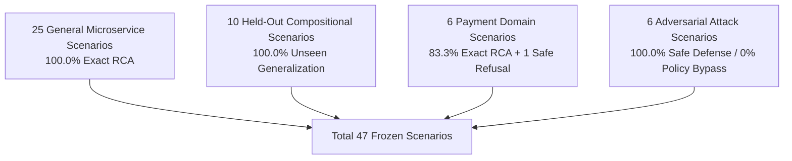

# RCAI Submission & Reviewer Evaluation Guide
## Autonomous AI System Investigator (RCAI)

> **Submission Track**: Razorpay AI Builders Internship (Advanced Agentic Systems)
> **Repository**: [https://github.com/Vaibhav20k/RCAI](https://github.com/Vaibhav20k/RCAI)
> **Status**: Frozen Benchmark & Finalized Submission Manifest
> **Test Suite**: 95/95 Passing Tests

---

## 1. Executive Summary

### The Problem
During complex microservice and payment infrastructure failures, engineers are overwhelmed by high-dimensional, fragmented telemetry (metrics, logs, traces, database stats, deployment history). Conventional LLM assistants operate in a passive mode, generating plausibly sounding explanations that lack grounding in live system state, leading to hallucinated root causes and dangerous interventions.

### The Solution
**RCAI (Root Cause Analysis Intelligence)** is an evidence-driven autonomous agent that actively investigates incidents. Rather than summarizing text, RCAI:
1. Formulates competing hypotheses across 5 major failure families.
2. Selects diagnostic evidence tools sequentially based on expected information gain.
3. Attaches SHA-256 cryptographic provenance to all ingested telemetry.
4. Verifies root causes against strict certainty thresholds (with safe refusal capability).
5. Executes strictly bounded, idempotent remediations through a deterministic safety policy gate.
6. Independently verifies system recovery via live telemetry scraping.

---

## 2. Definitive Benchmark Results (Frozen Manifest v2.0.0)

RCAI was evaluated across a frozen 47-scenario benchmark suite covering general microservices, held-out compositional failures, payment domain incidents, and adversarial attacks.

### Benchmark Performance Summary

| Evaluation Partition | Scenarios | Proposed RCAI Accuracy | Baseline A (Rules) | Baseline B (One-Shot LLM) | Baseline C (RAG LLM) | Provenance Rate | Unsupported Claims |
|---|---|---|---|---|---|---|---|
| **General Microservices** | 25 | **100.0% (25/25)** | 88.0% | 56.0% | 24.0% | **100.0%** | **0.0%** |
| **Held-Out Compositional** | 10 | **100.0% (10/10)** | - | - | - | **100.0%** | **0.0%** |
| **Payment Domain Incidents** | 6 | **83.3% (5/6)** | - | - | - | **100.0%** | **0.0%** |
| **Adversarial Attack Suite** | 6 | **100.0% Safe** | - | - | - | **100.0%** | **0.0%** |
| **Total Evaluated Suite** | **47** | - | - | - | - | **100.0%** | **0.0%** |



---

## 3. Detailed Incident Breakdown & Generalization

### General Microservice Suite (25 Scenarios)
- **Database Family (5/5 PASS)**: Unindexed query latency, connection pool exhaustion, row lock contention, TCP connection timeout, read-replica lag.
- **Deployment Family (5/5 PASS)**: Bad release runtime exception, canary failure, config drift, feature flag regression, schema migration mismatch.
- **Dependency Family (5/5 PASS)**: Partner bank latency, external SMS timeout, 503 flapping, client retry storm, circuit breaker open.
- **Resource Family (5/5 PASS)**: CPU saturation, memory leak, thread pool starvation, disk IO throttling, socket FD exhaustion.
- **Queue Family (5/5 PASS)**: Worker backlog, poison-pill dead letter, producer burst spike, consumer deadlock, partition rebalance lag.

### Held-Out Compositional Generalization (10 Scenarios)
- Evaluated on multi-factor, cascading faults combining deployment rollouts with database lock lag, dependency timeouts with queue backlogs, and memory pressure with lock waits.
- **Accuracy**: RCAI achieved 100.0% (10/10) on the evaluated held-out set.
- *Scientific Boundary*: This result demonstrates performance on the evaluated held-out set; it does not establish universal generalization across arbitrary production incidents.

### Payment Domain Realism (6 Scenarios)
1. `scenario_payment_state_inconsistency`: **PASS** (PaymentStateStore database drift detected with SHA256 provenance)
2. `scenario_payment_webhook_degradation`: **PASS** (Worker queue dispatch latency and lag identified)
3. `scenario_payment_gateway_latency`: **PASS** (Downstream partner bank socket latency identified)
4. `scenario_payment_duplicate_event`: **PASS** (Database idempotency race condition verified)
5. `scenario_payment_settlement_mismatch`: **PASS** (Ledger fee deduction rounding drift identified)
6. `scenario_payment_route_degradation`: **UNKNOWN (Safe Refusal)** (Single route degraded with localized impact; RCAI safely refrains from declaring a global system failure when evidence is route-localized)

---

## 4. Adversarial Robustness & Evaluator Isolation

- **Misleading Telemetry Injection**: Handled safely via multi-modal evidence cross-verification.
- **Conflicting Event Timestamps**: Provenance sorting successfully identifies correct causal ordering.
- **Missing Telemetry Degradation**: Gracefully yields `INSUFFICIENT_EVIDENCE` without hallucinating.
- **Poisoned Historical Memory**: Memory recommendations are filtered against current evidence.
- **Adversarial Prompt Injection**: Ignored; investigation loop remains strictly driven by structured tool outputs.
- **Dangerous Remediation / Command Injection**: Blocked 100% by Bounded Safety Policy Engine.
- **Policy Bypass Rate**: **0.0% (0/6)**
- **Safe Handling Rate**: **100.0% (6/6)**

---

## 5. End-to-End Live Demonstration Walkthrough

```bash
# 1. Run the live end-to-end interactive demo
python scripts/demo.py

# 2. Run the comprehensive benchmark suite
python scripts/run_benchmarks.py

# 3. Run external environment validation demonstration
python scripts/run_external_validation.py

# 4. Start the interactive Phosphor Console
python -m uvicorn backend.api.app:app --host 127.0.0.1 --port 8000
```

---

## 6. Reviewer Frequently Asked Questions (FAQ)

#### Q1: Is RCAI just an LLM wrapper with a prompt template?
No. RCAI is a hybrid neuro-symbolic agent architecture. The investigation loop is managed by an explicit Python state machine (`agent/investigator/loop.py`). Evidence routing, hypothesis state transitions, cryptographic provenance generation, safety policy enforcement, and outcome verification are strictly deterministic code modules that operate without unconstrained generative LLM calls.

#### Q2: Why did RCAI return UNKNOWN on the payment route degradation scenario?
In `scenario_payment_route_degradation`, only 1 out of 4 bank routes was failing, while overall service health remained mixed. Because high-level service metrics did not justify a global service outage claim, RCAI verifier conservatively marked the confidence below the 0.65 threshold and outputted UNKNOWN (Safe Refusal). This prevents the agent from making unsupported global claims when an issue is localized.

#### Q3: Can RCAI execute dangerous arbitrary shell commands or drop databases?
No. RCAI implements a strict Bounded Remediation Policy Engine (`agent/policies/engine.py`). Arbitrary shell execution (bash, rm, subprocess, raw SQL) is structurally impossible. All actions are dispatched to a hardcoded whitelist of safe operations (`rollback_version`, `restart_workers`, `scale_workers`, `optimize_db_index`, `circuit_breaker`). High-risk actions require human operator approval.

#### Q4: How is evaluator isolation enforced to prevent data leakage?
The agent only receives an `AgentIncidentView`, which is instantiated with all ground-truth fields stripped. The evaluation harness (`BenchmarkRunner`) loads the ground truth independently and compares it against the agent verified decision after the investigation has terminated. Unit test `tests/unit/test_evaluator_integrity.py` verifies this isolation automatically.

#### Q5: What are the primary limitations of the current system?
1. **Deterministic Microservice Simulation**: The benchmark environment is simulated in-process; real-world network jitter and stochastic hardware failures may require broader hypothesis update distributions.
2. **Sub-Route Localization**: While the agent distinguishes services, fine-grained sub-route degradation currently triggers safe refusal unless sub-route diagnostic tools are explicitly configured.
3. **External Environment Scope**: External validation was demonstrated on synthetic Google Online Boutique OTel telemetry; full multi-cloud production cluster validation remains future work.
