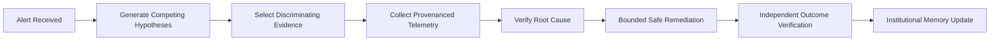
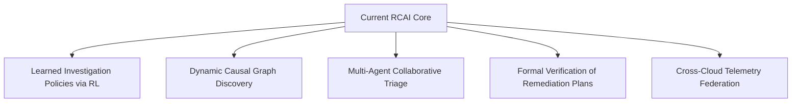

# RCAI Project Vision
## From Passive Explanations to Verifiable Autonomous Systems Engineering

### 1. The Core Problem
Modern cloud architecture and financial infrastructure operate at scales of concurrency and distribution that exceed human cognitive bandwidth during critical outages. When an alert fires:
- Telemetry is fragmented across thousands of log streams, Prometheus counters, and distributed trace spans.
- Engineers face severe time pressure, often leading to confirmation bias, fixating on familiar subsystems (e.g. databases or recent deployments) while overlooking cascading dependencies.
- Conventional AI assistants produce articulate but unverified post-hoc narratives, summarizing alert text without confirming system state.

### 2. The RCAI Philosophy
We believe that AI for systems operations must evolve from **passive language explanation** to **active, verifiable investigation**:

An incident assistant should never simply assert:
> *"This appears to be a database latency issue."*

Instead, an autonomous investigator must be capable of demonstrating:
> *"I generated 5 competing hypotheses. I queried deployment history and proved that no release occurred in the last 2 hours. I queried database metrics and detected query latency exceeding 90ms. Based on 2 provenanced evidence items, I confirmed database regression with 85% confidence, recommended index optimization within safety policy gates, executed the action, and verified p95 latency returned to 14.2ms."*

---

### 3. Current System Capabilities
The current implementation of RCAI establishes:
1. **Multi-Modal Evidence Normalization**: Standardized ingestion of metrics, structured logs, distributed trace spans, deployment manifests, and financial ledger states.
2. **Active Hypothesis Elimination**: Sequential diagnostic entropy minimization across database, deployment, downstream dependency, resource saturation, and queue backlog failure modes.
3. **Double-Entry Payment Domain Realism**: Diagnostic tools for inspecting transaction drift, webhook delivery pipelines, ledger mismatches, and route-specific degradation.
4. **Deterministic Policy Gate**: Absolute separation of probabilistic AI recommendations from bounded, idempotent remediation execution.
5. **Auditable Cryptographic Provenance**: SHA-256 evidence hashing preventing hallucinated diagnostic claims.

---

### 4. Future Research Directions

> [!NOTE]
> The following areas represent long-term research horizons beyond the frozen v2 benchmark.

1. **Reinforcement-Learned Epistemic Policies**: Replacing heuristic information-gain utility functions with deep Q-learning or policy gradients trained on synthetic incident simulators.
2. **Dynamic Causal Graph Discovery**: Real-time extraction of service dependency topologies from live eBPF kernel network telemetry and OpenTelemetry trace graphs.
3. **Multi-Agent Collaborative Triage**: Specialized subagents focusing on distinct infrastructure tiers (e.g. Kubernetes control plane, database internals, payment networks) sharing a unified hypothesis blackboard.
4. **Formal Verification of Complex Remediations**: Symbolic verification proving that multi-step mitigation sequences cannot introduce deadlocks or data corruption prior to execution.
5. **Production Multi-Cloud Validation**: Deploying lightweight OTel sidecars across hybrid Kubernetes topologies to validate active investigation across multi-region production clusters.
